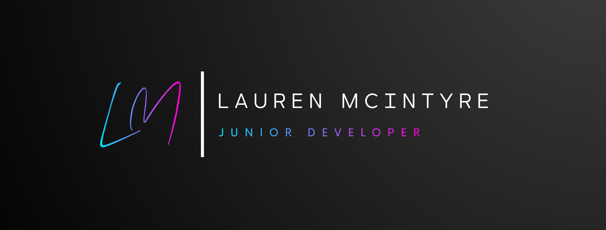

  

  

  

<h1 align="center">
  &nbsp hello world!
  
</h1>

  

---

## 👩‍💻 About Me :

I am a **Junior Full Stack Software Developer** from the East Midlands, UK 

- 🔀 I am a dedicated career changer
- 🥾 I have recently completed an intensive and comprehensive [Northcoders](https://northcoders.com) bootcamp to gain a multitude of technical skills
- 🧠 I am keen to further my technical knowledge and skill base whenever I can
- 💪 I'm seeking employment where I can put to use my newfound skills and talents

- 📬 How to reach me:
  - 
  - [📨 email me](mailto:lauren.a.mcintyre@gmail.com)

---

## 🧰 Technical Skills :  
 

  &nbsp;
  &nbsp;
  &nbsp;
  &nbsp;
  &nbsp;
  &nbsp;
  &nbsp;
  &nbsp;
  &nbsp;
  &nbsp;
  &nbsp;
  &nbsp;
  &nbsp;
  &nbsp;
  &nbsp;
  
  
and more to come...

---

<section align="center">
  You are viewing this page in
  <source media="(prefers-color-scheme: dark)" srcset="https://user-images.githubusercontent.com/25423296/163456776-7f95b81a-f1ed-45f7-b7ab-8fa810d529fa.png">
  <source media="(prefers-color-scheme: light)" srcset="https://user-images.githubusercontent.com/25423296/163456779-a8556205-d0a5-45e2-ac17-42d089e3c3f8.png">
  
  mode
</section>
